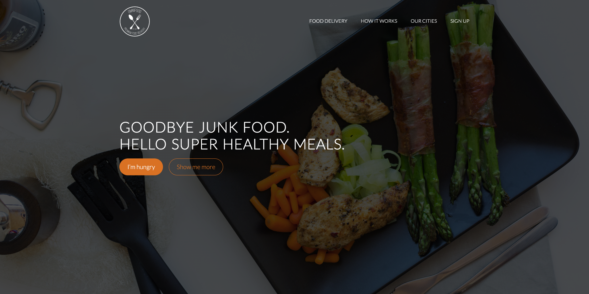
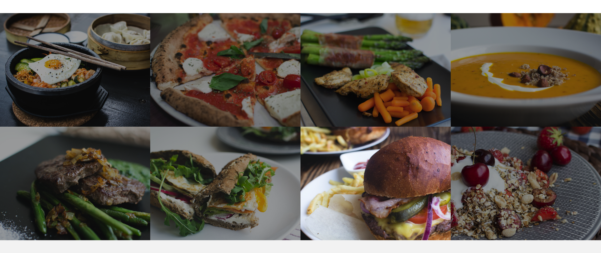
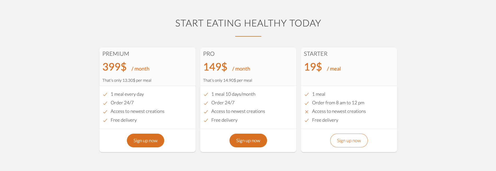
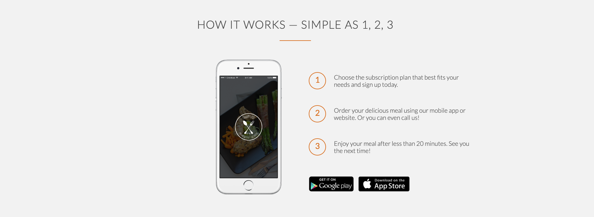

# Frontend Practise (*HTML5, CSS3*)

## Layout with float 

This is written in desktop first approach.

### *Float Left and Clear Both is used for layout*

### Here is [live demo](https://food-order-website-mauve.vercel.app/)

### Preview

